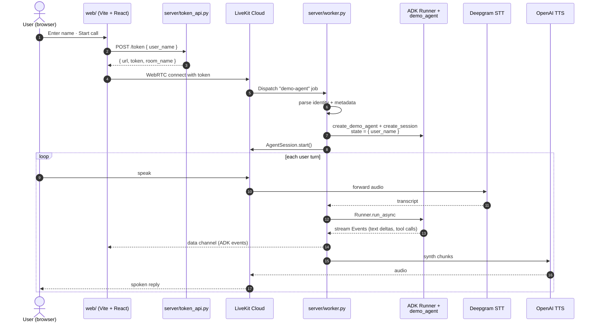

# LiveKit + Google ADK — minimum reproducible example

A small, self-contained example of a [LiveKit Agents](https://docs.livekit.io/agents/)
voice worker whose LLM step is delegated to a [Google ADK](https://google.github.io/adk-docs/)
agent. Built to share with the LiveKit team for feedback on the
integration pattern.

The interesting file is `server/adk_bridge.py` (~120 lines). Everything
else exists so a reviewer can clone, set env vars, run two commands,
and have a working voice agent to talk to.

## Architecture



## How the bridge works

`server/adk_bridge.py` defines `AdkVoiceAgent`, a subclass of
`livekit.agents.Agent` that overrides `llm_node`. LiveKit calls
`llm_node(chat_ctx, tools, model_settings)` once per turn and expects
an async iterable of `ChatChunk`. Inside, we:

1. Pull the latest user message from `chat_ctx`.
2. Wrap it as `google.genai.types.Content`.
3. Hand it to `InMemoryRunner.run_async`, keyed by the LiveKit room.
4. Drain ADK `Event`s, yield each text part as a `ChatChunk(delta=…)`.
5. Mirror every ADK event onto LiveKit's data channel so the frontend
   debug panel can render the conversation in real time.

The `llm=` we pass to `AgentSession(...)` is the LiveKit-required
fallback. With `llm_node` overridden, it is never called.

## Quick start

You'll need API keys for: [LiveKit Cloud](https://cloud.livekit.io),
[Deepgram](https://console.deepgram.com),
[OpenAI](https://platform.openai.com), and
[Google AI Studio](https://aistudio.google.com/app/apikey) (free Gemini
key, no GCP project needed). If you'd rather use Vertex AI instead of
the Gemini API, see the commented block at the bottom of
`server/.env.example`.

```bash
# 1. Server
cd server
cp .env.example .env
$EDITOR .env             # fill in LiveKit / Deepgram / OpenAI / GCP keys
pip install -e .
python worker.py download-files   # pulls Silero VAD + turn detector
# Terminal A:
python worker.py dev
# Terminal B:
uvicorn token_api:app --host 0.0.0.0 --port 8000 --reload

# 2. Web (separate terminal)
cd ../web
pnpm install
pnpm dev    # http://localhost:5173
```

Or with Docker:

```bash
cp server/.env.example server/.env
$EDITOR server/.env
docker compose up --build
cd web && pnpm install && pnpm dev
```

## What the demo agent can do

`server/demo_agent.py` defines a small ADK `LlmAgent` (`DemoCoordinator`)
with one sub-agent (`SearchAgent`) and four function tools:

| Tool | What it shows |
|---|---|
| `get_current_time()` | Plain function calling, zero args |
| `lookup_user(name)` | Args + structured return value |
| `set_status_message(text)` | Voice → UI via LiveKit data channel |
| `search_facts(query)` (on sub-agent) | Delegation between ADK agents |

Try saying:

- "What time is it?"
- "Look up Bob's email."
- "Tell me about LiveKit." (delegates to `SearchAgent`)
- "Show 'hello from voice' on screen." (publishes to data channel)

## What we'd love LiveKit's feedback on

1. **`Agent.llm_node` override vs `llm.LLM` subclass.** We chose the
   override path so we wouldn't have to implement the full LLM
   provider contract for what is really a per-turn driver. Is that
   the recommended pattern, or are we missing a contract LiveKit
   expects to be honored (token counting, error shapes, …)?

2. **Interruptions.** If the user interrupts mid-turn, the in-flight
   `Runner.run_async` is not cancelled. We can wrap it in
   `asyncio.shield` + `cancel()`, but is there a hook LiveKit prefers
   for "current turn is being cancelled"?

3. **Session lifecycle.** Each LiveKit room creates one
   `InMemoryRunner` per call. Should we share a Runner with a
   non-memory `SessionService` (DatabaseSessionService, Vertex AI)
   for long-running deployments, or is one-Runner-per-call fine?

4. **Tool call surfacing.** ADK executes function tools inside its
   Runner and we never expose them to LiveKit as `ChatChunk.tool_calls`.
   That keeps tool execution simple but means LiveKit's metrics/eval
   surface doesn't see them. Should we be threading them through?

5. **Streaming granularity.** ADK emits cumulative text in `Event`s; we
   diff-and-yield the new tail as `ChatChunk(delta=…)`. Is there a
   better way to yield mid-tool-call narration so TTS can start
   speaking earlier?

6. **Session state seeding via dispatch metadata.** We pass
   `{ user_name }` from the token's `RoomAgentDispatch.metadata` into
   ADK's session state. Is there a more LiveKit-native pattern for
   carrying per-call context that we missed?

## File map

```
livekit-adk-mre/
├── docker-compose.yml
├── README.md                       ← you are here
├── server/
│   ├── adk_bridge.py               ← THE artifact for feedback
│   ├── demo_agent.py               ← toy ADK agent + tools + sub-agent
│   ├── worker.py                   ← LiveKit Agents worker entrypoint
│   ├── token_api.py                ← FastAPI /token endpoint
│   ├── pyproject.toml
│   ├── Dockerfile
│   └── .env.example
└── web/                            ← Vite + React + LiveKit components
    ├── src/
    │   ├── App.tsx
    │   ├── components/CallPanel.tsx
    │   ├── components/DebugPanel.tsx
    │   └── hooks/useToken.ts
    └── package.json
```

## License

MIT — see `LICENSE`.
